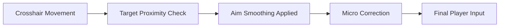

# Valorant Aim Assist

Aim, in **Valorant**, is not just muscle memory.
It’s patience. A held breath. A quiet agreement between eye and hand.

**Valorant Aim Assist** is built for that fragile space between intention and impact—a precision-focused PC tool designed to help players study crosshair discipline, recoil behavior, and tracking flow in controlled environments. It does not shout. It nudges. Softly. Repeatedly. Until understanding settles in.

---

## 🧭 Overview

The **Valorant Aim Assist** is a targeting-support utility engineered for offline practice scenarios, aim training, and controlled testing setups. Its purpose is not brute-force automation, but *guided precision*: subtle corrections, configurable smoothing, and adjustable response curves that help analyze aiming mechanics.

Think of it as training wheels for the nervous system—meant to be noticed, then eventually outgrown.

---

## 🎯 Precision-Focused Capabilities

* **Soft Aim Correction** – Gentle magnet-style assistance near targets
* **Custom FOV Radius** – Define how close the crosshair must be to engage 🎯
* **Recoil Compensation Control** – Adjustable vertical and horizontal balance
* **Smoothing Curves** – Human-like motion, no snapping
* **Bone Selection Logic** – Head, upper chest, or dynamic zones
* **Reaction Delay Slider** – Add natural latency for realism
* **Hotkey Toggles** – Enable, adjust, or pause instantly 🎮

[!WARNING]
This tool is intended **strictly for training, testing, and educational environments**. It is not designed for live competitive matchmaking.

---

## ⚙️ Setup Flow

No noise. No clutter. Just steps:

1. Start **Valorant** and remain at the menu or practice environment
2. Run the Aim Assist software as **Administrator**
3. Confirm successful process attachment
4. Enter training or controlled testing mode
5. Adjust values gradually—feel before forcing

Example hotkeys:

```text
F1 – Toggle Aim Assist
F2 – Increase Smoothing
F3 – Decrease FOV Radius
F4 – Recoil Control On/Off
END – Disable All Modules
```

[!IMPORTANT]
Always keep configurations conservative. Subtlety teaches more than excess.

---

## 🔄 Targeting Logic (Conceptual Flow)



The assist never replaces intent—it only shapes the path your hand already chose.

---

## ❓ FAQ

**Is this a full aimbot?**
No. It focuses on soft assistance and learning-oriented correction, not automation.

**Can I customize everything?**
Yes. FOV, smoothing, delay, recoil strength—all independently adjustable.

**Does it affect system performance?**
Negligibly. The tool is lightweight and memory-efficient.

**Is it beginner-friendly?**
Yes. Default presets are extremely mild and designed for observation first.

**Will updates be needed?**
Adjustments may be required after major game updates.

---

## 🌒 Final Reflection

Perfect aim is not something you *switch on*.
It’s something you approach—step by step, miss by miss.

**Valorant Aim Assist** exists in that in-between space, where learning feels less punishing and patterns become visible. Use it thoughtfully. Use it quietly. And when your hands no longer need it—let it go.
